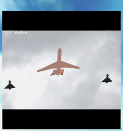
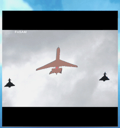
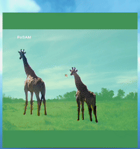
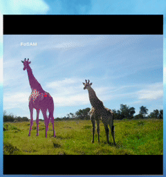
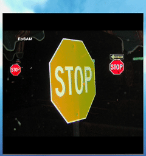
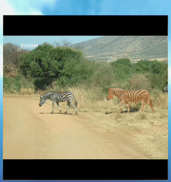
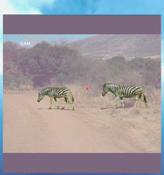
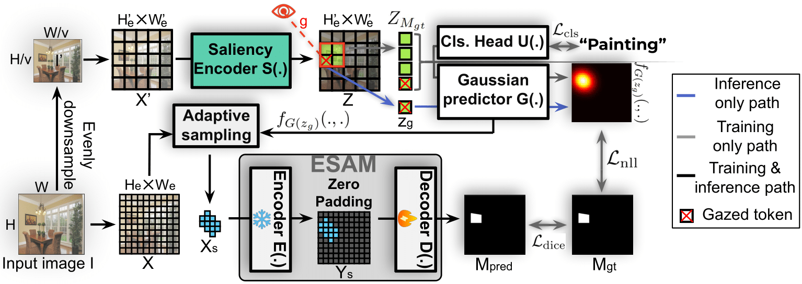

# FoSAM: Foveated Segment Anything Model

This repository contains the official implementation of the paper "Foveated Segment Anything Model" (FoSAM).

## Abstract

Augmented Reality (AR) encompasses transformative technologies that are redefining how humans interact with their environment. A key component of AR is image segmentation, which breaks down the user's front-view scene into distinct regions for analysis. This process is essential for accurately overlaying digital content onto the physical world by detecting and isolating relevant objects. However, despite its importance, image segmentation poses significant computational demands and latency issues on AR devices, which can severely impact the overall user experience. In this paper, we propose *Foveated Segment Anything Model* (FoSAM), a framework built upon the Segment Anything Model (SAM) that utilizes real-time gaze data to focus segmentation on regions of interest, substantially lowering computational cost. Experimental results show that FoSAM reduces computational cost by over 50×, enabling a seamless visual experience for users, as confirmed by our real-world user study.

## Comparison: FoSAM vs SAM

Below are comparisons showing the runtime efficiency of FoSAM compared to SAM in user study

| FoSAM | SAM | FoSAM | SAM |
|-------|-----|-------|-----|
|  |  |  |  |

| FoSAM | SAM | FoSAM | SAM |
|-------|-----|-------|-----|
|  |  |  |  |

## Framework Overview

FoSAM significantly reduces the computational requirements of image segmentation in AR environments by focusing processing only on areas where the user is looking. The framework leverages natural human eye behavior to prioritize segmentation on the instance of interest (IOI) while ignoring peripheral regions.

## Main Contributions

1. We introduce a novel perspective on instance segmentation with SAM that exploits human eye behavior to reduce computational costs in AR settings.
2. We propose FoSAM, a lightweight segmentation framework built on ESAM, which processes high-resolution input images and performs instance segmentation on the IOI with extremely low computational cost.
3. Building on FoSAM, we introduce FoSAM Streaming Algorithm (FSA), an efficient instance segmentation framework tailored for real-time AR/VR applications. FSA exploits temporal continuity across frames and human gaze patterns to optimize segmentation, delivering enhanced performance in dynamic AR environments.

## Experimental Results

Our evaluation on public datasets shows that FoSAM achieves comparable segmentation quality to full-resolution methods while drastically reducing computational requirements:

| Method | K | ADE20K | LVIS | Cityscape | GFLOP |
|--------|---|--------|------|-----------|-------|
| SAM-B | 4096 | 0.511 | 0.537 | 0.347 | 744 |
| ESAM-S | 4096 | 0.411 | 0.359 | 0.304 | 188.2 |
| ESAM-T | 4096 | 0.350 | 0.236 | 0.248 | 56.1 |
| SlimSAM-S | 4096 | 0.477 | 0.474 | 0.293 | 15.1 |
| SlimSAM-T | 4096 | 0.461 | 0.458 | 0.263 | 11.0 |
| FSNet-DL | NA | 0.34 | 0.38 | 0.24 | 18.8 |
| FSNet-SF | NA | 0.33 | 0.36 | 0.21 | 12.6 |
| **FoSAM-S** | 200 | **0.495** | **0.487** | **0.404** | **14.6** |
| **FoSAM-S** | 100 | **0.465** | **0.461** | **0.362** | **10.4** |
| **FoSAM-T** | 200 | **0.471** | **0.469** | **0.377** | **7.4** |
| **FoSAM-T** | 100 | **0.457** | **0.435** | **0.328** | **5.3** |

K denotes the token budget. FoSAM consistently outperforms competitive methods while requiring significantly fewer computational resources.

## Processing Latency

| Model | Token Budget | Latency (ms) |
|-------|-------------|--------------|
| FoSAM-S | 200 | 21.6 |
| FoSAM-S | 100 | 18.3 |
| FoSAM-T | 200 | 17.6 |
| FoSAM-T | 100 | 14.5 |

FoSAM achieves latencies well below the 30ms threshold required for seamless AR experiences.

## User Study

Our user study involving 7 participants showed that FoSAM was preferred in 96.9%±4.8% of trials over traditional SAM, demonstrating the real-world benefits of our approach for AR applications.

## License

[MIT License](LICENSE)
